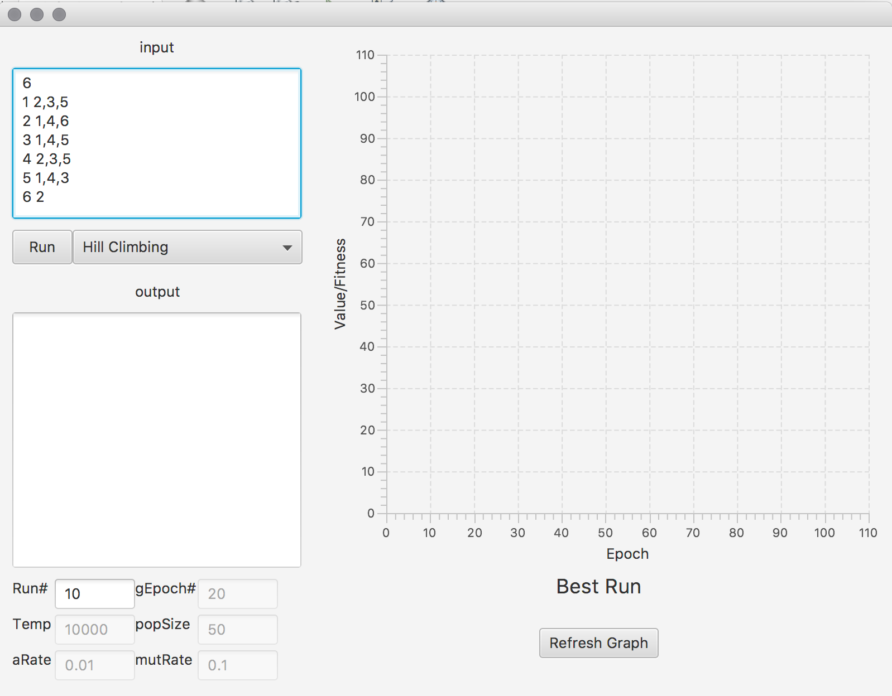

# Shelf-Assigning-Problem
> Solving Shelf Assigning Problem with Hill Climbing, Simulated Annealing and Genetic Algorithms

## Problem Description

We must assign various substances to distinct shelves in a laboratory in a way that any of substances do not react together and trigger chemical reaction.
In input in each line we address substances with a number and list of other number which trigger chemical reaction.
Find a configuration of substances in shelf such that minimize number of shelves and chemical reactions.

## Documentation

  Table Class :
  
  - for Holding input data and Making initial state for Hill Climbing and Simulated Annealing and population for Genetic Algorithm
  - List<Integer>[] subs is Array of a List for items that If you put it on the same shelf, it triggers chemical reaction. index of array denotes the item number. for example: subs[1] = {2, 3} means that if you put item #1 with any of 2 items (2 or 3) it causes chemical reaction.
  - in init()/init(long seed) it makes a random configuration of items in shelves

  Node Class:
  
  - Making Tree Data Structure for Hill Climbing and Simulated Annealing
  - String[] items is the represtation of a state ["1,2,3", "4", "5,6"] (item 1, 2, 3 in shelf 1 and ...) 
  - ArrayList<Node> is arraylist of children made in addChildren method
  - addChildren(int n) method in Node Class : making nodes that each one has items spread out across 'n' shelves with randomize configuration (one child is randomize order of its parent node for checking all state):
    - for example : apply addChildren(2) to node ["1, 2, 3, 4, 5"] (1 distinct shelf contain 5 item) -> may one of the results be ["2, 3", "1, 4, 5"] (2 distinct shelf each contain 2 and 3 items respectively - each node is array of string and each string represent each shelf)
  - getHeru(Table tlb) method in Node Class : calculate heruistic for node according to given table (-150 points for each conflict in any shelf and -100 points for each shelf used)
  
  
  HillClimbing Class:
  
  - start from initial state and find a state with higher heruistic (may stuck in local maxima)
  

  
  SimulatedAnnealing Class:
  
   - start from initial state and find a state with higher heruistic with probility of exp((newEnergy - energy) / temperature) (may stuck in local maxima)
  

  
  Genetic Class:
  
  - first it makes a population of number given in input (popSize) converting each table initial state to a chromosome for example state ["1,2", "3", "4,5"] chromosome is "11233" (position of each character is item's number and character value is the shelf number) and fitness of each is calcualted (fitness function is the same as heuristic function).
  - in fitness function it always trim the sorted chromosome list in a way that list size be always equal to popSize.
  - then in solve method it does a selection, crossover and mutation on each chromosome follow by another population and evaluating fitness in each epoch(generation).
  - 66% of selection is based on fitness and 33% is based on luck(randomness) (ordering the chromosome list)
  - then each chromosome is crossovered with the next chromosome in the list.
  - with a chance of mutRate some character of a chromosome might mutate.
  

  

## Author

  - Soheil Changizi ( [@cocolico14](https://github.com/cocolico14) )

## License

This project is licensed under the MIT License - see the [LICENSE](./LICENSE) file for details

