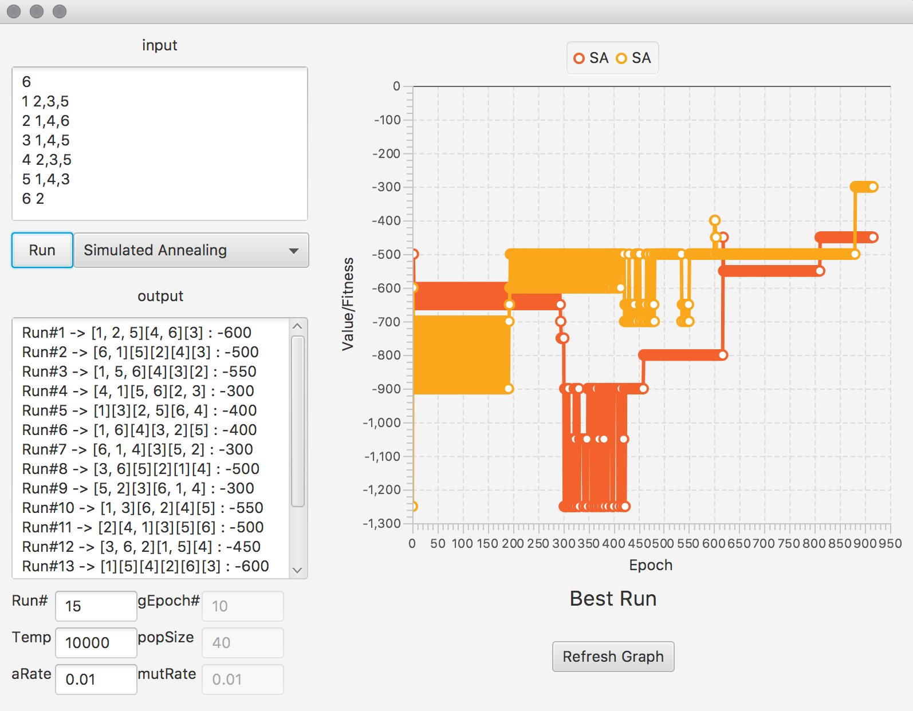

# Shelf-Assigning-Problem
Solving Shelf Assigning Problem with Hill Climbing, Simulated Annealing and Genetic Algorithms

## Problem Description

## Documentation

  Table Class :
  
  - for Holding input data and Making initial state for Hill Climbing and Simulated Annealing and population for Genetic Algorithm
  - List<Integer>[] subs is Array of a List for items that If you put it on the same shelf, it creates danger. index of array denote the item number. for example: subs[1] = {2, 3} means that if you put item #1 with any of 2 items (2 or 3) it causes danger.
  - 

  Tree and Node Classes:
  
  - Making Tree Data Structure for Hill Climbing and Simulated Annealing
  - String[] items is the represtation of a state ["1,2,3", "4", "5,6"] (item 1, 2, 3 in shelf 1 and ...) 
  - ArrayList<Node> is arraylist of children made in addChildren method
  - addChildren(int n) method in Node Class : making nodes that each one has items spread out across 'n' shelfs with randomize configuration (
    - for example : apply addChildren(2) to node ["1, 2, 3, 4, 5"] (1 distinct shelf contain 5 item) -> one of the result maybe is  ["2, 3", "1, 4, 5"] (2 distinct shelf each contain 2 and 3 items respectively - each node is array of string and each string represent each shelf)
  - getHeru(Table tlb) method in Node Class :
  
  
  HillClimbing Class:
  
  -
  
  
  
  SimulatedAnnealing Class:
  
  -
  
  
  
  Genetic Class:
  
  -    
  
  
  
  FXMLDocumentController Class:
  
  -
  
  
